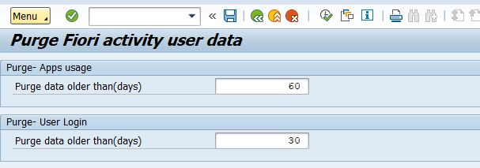
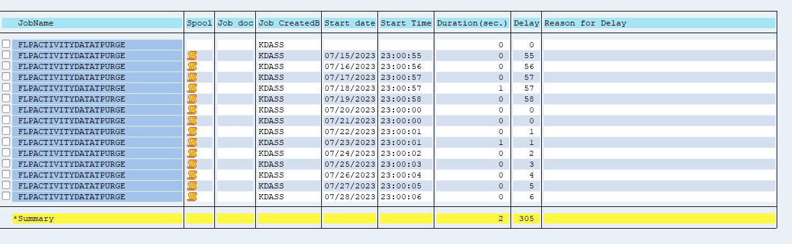

# Important Notice
This public repository and an open source project and we look forward for all of you to make use of it and come forward for improvements/feedback and features.

# SAP Fiori Plugin: User Click Event
This is part one of "Fiori tiles usage and User monitoring for SAP Fiori launchpad (Monitoring SAP Fiori Launchpad)"

## Introduction 
For any application or product monitoring and usage statistics is undoubtedly one of very demanded and most helpful when it comes to evaluate any planning to be done or decisions to be taken.

A detailed background has been mentioned in [SAP Blog](https://blogs.sap.com/?p=1416621) 

## Target Audience 
This document is for whom has the experience of SAPUI5 along with ABAP OData service development

## Preview

## Implementation Steps

### Program
- Use ABAP zflp_activitydata_purge to purage data from tables using AMDP(optional, could use OPEN SQL on ABAP layer as well)

### SM37 Job
- Schedule SM37 job as per your choice of days

